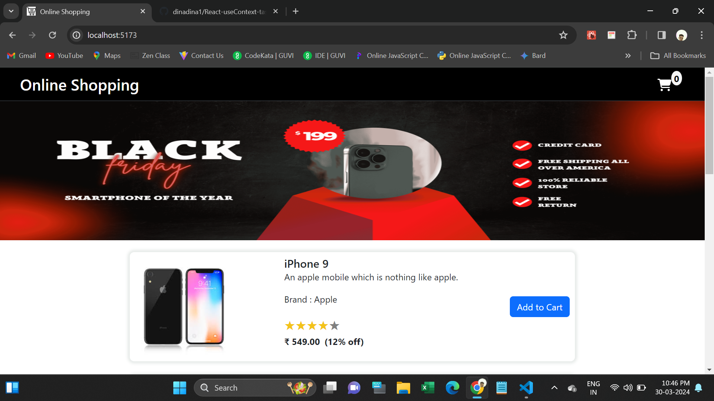
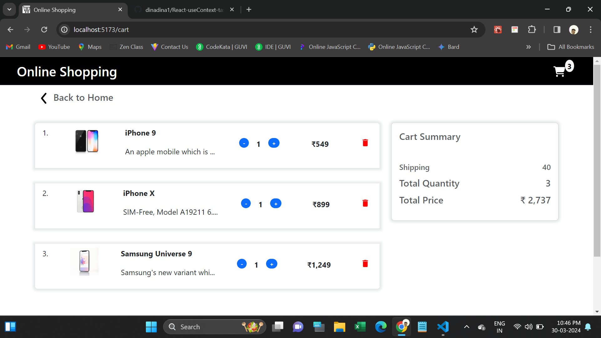

# React useContext Task

This webpage are showing products to add to cart.

When user clicking the Add to cart button it will changed Goto cart and also added count to cart. At the same time the product will be added into cart section.

User can Remove cart product in cart section only.

In cart section added some functionalities like increase or decrease 
 product quantity, automatically update total quantity and price.

 
All the data passed parent to child component through Context API.

  <h4>Used Tools.</h4>
  
It works with React Router-Dom.

<ul>
  <li>Html</li>
  <li>CSS</li>
  <li>Bootstrap</li>
  <li>Javascript</li>
  <li>React JS</li>
</ul>
<h4>Npm Packages are used:</h4>
<ul>
  <li>https://www.npmjs.com/package/bootstrap</li>
  <li>https://www.npmjs.com/package/react-router-dom</li>
  <li>https://www.npmjs.com/package/react-rating-stars-component</li>
  <li>https://www.npmjs.com/package/react-icons</li>
</ul>
<h3>Deployed URL</h3>

<h5>Screenshots</h5>
1.Home Page

2.Cart Page

